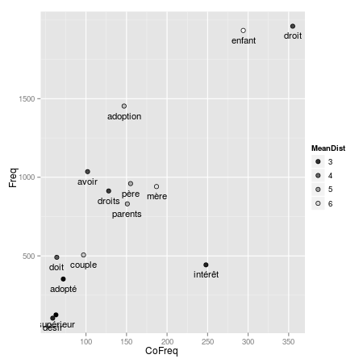
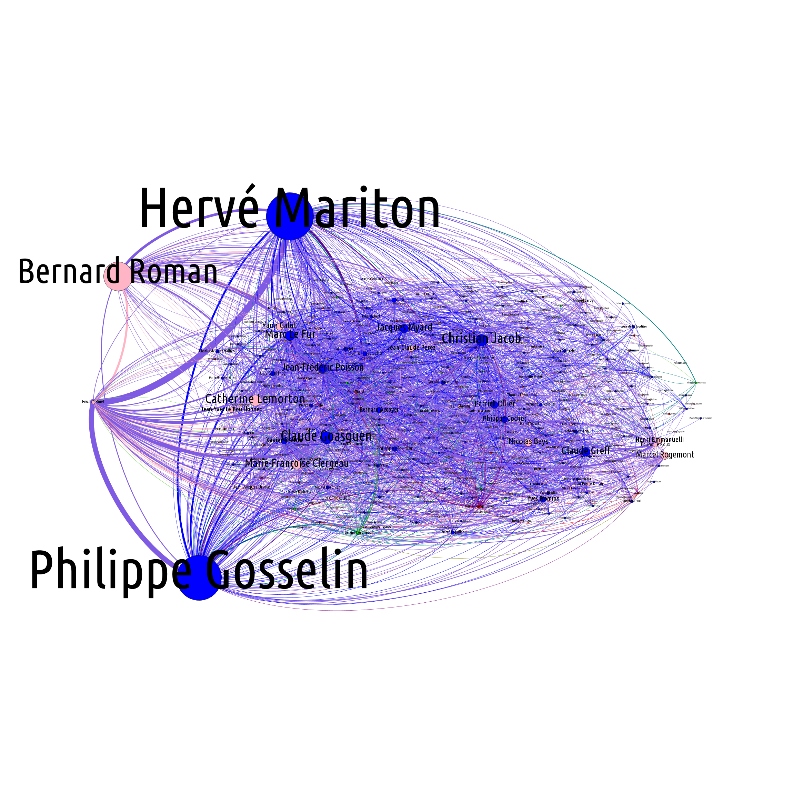

Ce projet vise a encoder en XML les séances de l'Assemblée Nationale
sur l'ouverture du mariage aux couples de même sexe afin de pouvoir
les retransformer « proprement » en quoique ce soit (docbook,
xhtml...), dans le but, par exemple, de faire des recherches
lexicographiques avec des outils comme
[Philologic](https://sites.google.com/site/philologic3/) ou
[TXM](http://textometrie.ens-lyon.fr/).

Je décris l'[encodage](Encoding.fr.md) sur sa propre page.

Télécharger
===========

[MPT_2013-03-19](http://perso.obspm.fr/nicolas.legrand/MPT_2013-03-19.zip),
est importable en l'état dans
[Philologic](https://sites.google.com/site/philologic3/) ou dans
[TXM](http://textometrie.ens-lyon.fr/)) via le module XML+w/CSV.

Exemples de résultats
=====================

J'ai écris sur mon [carnet hypothèse](http://eproto.hypotheses.org/)
un [premier billet](http://eproto.hypotheses.org/126) débroussaillant
ce que l'on peut tirer de ces débats.

Il est aussi possible de générer des graphiques de ce type :

Vous voyez tous les mots coocurrents du mot « enfant » avec leur
propre fréquence, leur fréquence de cooccurrence ainsi que la
distance moyenne de chaque mots avec le mot « enfant ».

Ce graphique a été réalisé avec un résultat de cooccurrences de
[TXM](http://textometrie.ens-lyon.fr/) et la bibliothèque ggplot2 de
R.

On peut aussi parser le XML avec le script tei_to_gexf.py (fichier
généré par le `make` dans files/gexf/ - actuellement cassé) et faire
un [graph des interruptions](interruptions.png) :

Plus un député interrompt un autre (pour le féliciter ou le
contredire : « Bravo », « C'est faux » etc...) plus son nœud apparaît
en gros. L'arête grossi en fonction du nombre d'interruption qui ont
lieu entre les deux protagonistes. Ce diagramme pose encore des
problèmes : on n'y voit pas Christianne Taubira. Cela dit, on voit
déjà qu'Hervé Mariton et Philippe Gosselin ont été particulièrement
virulents, et notament contre Erwann Binet qui n'a lui que peu
interrompu les autres.

Référence
=========

Serge Heiden m'a averti de l'existence de deux articles de la revue
[Mots, les langages du politique](http://mots.revues.org/) de 1999
donnant de très bonnes idées d'exploitation de ce type de corpus :

- S. Bonnafous, D. Desmarchelier : « [Quand les députés coupent le
  RESEDA](http://www.persee.fr/web/revues/home/prescript/article/mots_0243-6450_1999_num_60_1_2166) » ;

- S. Heiden : [Encodage uniforme et normalisé de corpus. Application à
  l'étude d'un débat
  parlementaire](http://www.persee.fr/web/revues/home/prescript/article/mots_0243-6450_1999_num_60_1_2168).

Todo
====

Tester automatiquement la validité du XML (fait grossièrement par
`xsltproc(1)`).

Erreur ?
========

regardscitoyen fait déjà des extractions de cette base et met des
[dumps SQL à
disposition](http://www.regardscitoyens.org/telechargement/donnees/). L'utilisation
de ce dump aurait sans doute été plus propre. Cependant comme j'ai
commencé avec ma méthode avec laquelle je suis familiarisé, je
rechigne à comprendre le dump SQL pour l'exploiter. J'aurais
clairement préféré un fichier XML comme donnée textuelle.

En revanche un nouveau travail qui consisterait à charger d'autres
débats, voir l'ensemble des débats depuis 2007 gagnerait à utiliser le
travail de regardscitoyens.

Et non, je n'ai pas honte de réinventer la roue :), parce que je
m'amuse beaucoup et que de toutes façons, je fais ça pour le fun.
